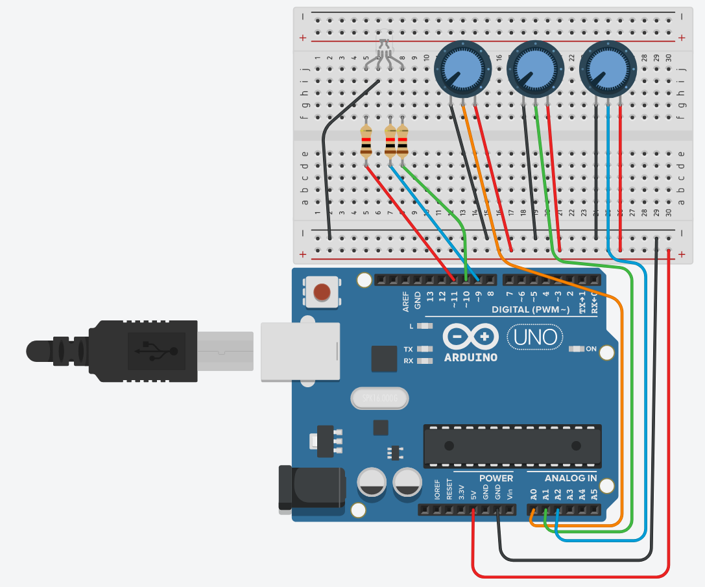

# RGB led with Arduino

[](https://github.com/mrouillard/RGB_led_arduino/blob/master/LICENSE)

## parts list

* 1 RGB Led (the one I have has the long pin as the common cathod (-))
* three 1kOhm resistors
* three 200K potentiometers
* arduino UNO

## circuit



## code

```C++
int PotarRouge = 0;
int PotarVert = 0;
int PotarBleu = 0;

void setup() {
  pinMode(A0, INPUT);
  pinMode(A1, INPUT);
  pinMode(A2, INPUT);
  pinMode(11, OUTPUT);
  pinMode(10, OUTPUT);
  pinMode(9, OUTPUT);
  Serial.begin(57600);

}

void loop() {
  PotarRouge = analogRead(A0);
  analogWrite(11, PotarRouge / 4);
  //Serial.print("Rouge: ");
  //Serial.print(PotarRouge / 4, DEC);
  
  PotarVert = analogRead(A1);
  analogWrite(9, PotarVert / 4);
  //Serial.print(" / Vert: ");
  //Serial.print(PotarVert /4, DEC);
  
  PotarBleu = analogRead(A2);
  analogWrite(10, PotarBleu / 4);
  //Serial.print(" / Bleu: ");
  //Serial.println(PotarBleu / 4, DEC);  

  delay(250); // Wait for 250 millisecond(s)
}
```
